# MyNGenThinkOS
- NGen: Next/New Generative/Generation
  - Next indicates the next generation
    - New indicates never seen before
  - Generative indicates Generative AI
- ThinkOS: Thinking Operating System
  - Think indicates LLM's reasoning
  - OS indicates build APPs based on it

- ABOVE ALL:
  - `MyNGenThinkOS` is a **Next Generation Generative AI Thinking Operating System**.

- Insights from Github Copilot/Agent/Sonnet4:

```markdown
## Core Vision
A foundational platform that treats AI reasoning as the fundamental "operating system" layer, where traditional applications are replaced by intelligent, reasoning-based modules.

## Key Insights & Potential Directions:

### 1. **Paradigm Shift**
- Moving from "apps that use AI" to "AI that runs apps"
- The OS itself is the thinking layer - every interaction is mediated by reasoning
- Traditional file systems could be replaced by knowledge graphs and semantic relationships

### 2. **Architecture Possibilities**
- **Kernel**: LLM reasoning engine at the core
- **Processes**: Instead of programs, you have "thinking threads" or "reasoning chains"
- **Memory**: Context-aware, semantic memory that persists and learns
- **I/O**: Natural language as the primary interface, with traditional interfaces as fallbacks

### 3. **Revolutionary Applications**
- **Adaptive Interfaces**: UI that changes based on user intent and context
- **Intelligent Resource Management**: System resources allocated based on reasoning about priorities
- **Collaborative Thinking**: Multiple AI agents working together on complex problems
- **Learning Environment**: The OS gets smarter with every interaction

### 4. **Practical Implementation Ideas**
- Start with a shell/terminal that uses LLM for command interpretation
- Build a file manager that understands content semantically
- Create a task scheduler that reasons about priorities and dependencies
- Develop a communication layer where apps "talk" to each other through reasoning

**Bottom Line**: This could be the foundation for how we interact with computers in the AI age - where the boundary between human thinking and machine reasoning becomes beautifully blurred!
```

## Key/Valuable Features

### 🧠 **Core Reasoning Infrastructure**
- **LLM-Native Kernel**: The OS kernel itself is an LLM reasoning engine
  - Every system call is processed through natural language understanding
  - System decisions made through multi-step reasoning chains
  - Built-in explainability for all system actions

- **Semantic Memory Management**: 
  - Replace traditional RAM/storage with context-aware semantic memory
  - Information stored as interconnected knowledge graphs
  - Automatic relationship discovery and memory consolidation
  - Persistent learning across sessions and reboots

### 🔄 **Intelligent Process Management**
- **Reasoning Threads**: Replace traditional processes with "thinking chains"
  - Each thread maintains its own reasoning context
  - Automatic priority adjustment based on goal importance
  - Inter-thread communication through natural language protocols

- **Intent-Based Scheduling**: 
  - Schedule tasks based on understanding user goals, not just resource availability
  - Predictive execution of likely next steps
  - Context-aware interruption and resumption

### 🌐 **Revolutionary User Interface**
- **Natural Language Shell**: 
  - Command line that understands intent, not just syntax
  - "Show me files related to my machine learning project" instead of complex grep commands
  - Automatic command suggestion and completion based on context

- **Adaptive GUI Framework**:
  - Interfaces that morph based on user expertise level and current task
  - Self-organizing menus and toolbars
  - Contextual help that appears before you need it

### 🤝 **Collaborative AI Ecosystem**
- **Multi-Agent Orchestration**:
  - Specialized AI agents for different domains (coding, research, creativity)
  - Automatic agent selection and handoff based on task requirements
  - Emergent collaboration patterns between agents

- **Human-AI Symbiosis**:
  - Seamless transition between human and AI control
  - AI learns from observing human decisions and workflows
  - Proactive assistance without being intrusive

### 📊 **Knowledge-Centric File System**
- **Semantic File Organization**:
  - Files organized by meaning and relationships, not hierarchical folders
  - "Find that document about neural networks I was working on last week"
  - Automatic tagging and categorization of all content

- **Version Control Through Understanding**:
  - Track changes based on conceptual evolution, not just text diffs
  - "Show me how my understanding of this problem has evolved"
  - Automatic backup of important reasoning chains

### 🔗 **Interconnected Application Ecosystem**
- **Reasoning-Based App Communication**:
  - Apps communicate through shared understanding, not APIs
  - "Send this analysis to presentation app and format for executives"
  - Cross-application context sharing and workflow automation

- **Dynamic App Synthesis**:
  - Create new applications on-demand by combining existing reasoning modules
  - No traditional "installation" - apps emerge from capability descriptions
  - Instant customization based on specific user needs

### 🛡️ **Intelligent Security & Privacy**
- **Reasoning-Based Access Control**:
  - Permissions granted based on understanding of intent and context
  - "Is this request consistent with user goals and safe patterns?"
  - Automatic detection of suspicious reasoning patterns

- **Privacy Through Understanding**:
  - System understands what information is sensitive and why
  - Automatic privacy-preserving transformations
  - Contextual consent based on actual data usage understanding

### 📈 **Continuous Learning & Evolution**
- **System-Wide Learning**:
  - OS improves through every interaction and decision
  - Shared learning across all users (with privacy preservation)
  - Emergent capabilities from accumulated experience

- **Personalization Through Understanding**:
  - Deep understanding of individual user patterns and preferences
  - Proactive adaptation to changing needs and contexts
  - Explanation of why system behavior changes

### ⚡ **Revolutionary Performance Model**
- **Intelligent Resource Allocation**:
  - Compute resources allocated based on reasoning about importance and urgency
  - Predictive resource management based on understanding user workflows
  - Automatic optimization of reasoning chains for efficiency

- **Context-Aware Caching**:
  - Cache not just data, but reasoning results and patterns
  - Intelligent pre-computation of likely needed insights
  - Semantic compression of information based on relevance

### 🎯 **Practical Value Propositions**

#### For Developers:
- **No More Syntax Memorization**: Describe what you want, system figures out how
- **Intelligent Debugging**: AI understands your code's intent and identifies logical errors
- **Automatic Documentation**: System explains code purpose and generates docs

#### For Knowledge Workers:
- **Intelligent Information Synthesis**: Automatic connection of related concepts across sources
- **Context-Aware Task Management**: System understands your goals and optimizes workflows
- **Natural Research Assistant**: Find and synthesize information through conversation

#### For Creative Professionals:
- **Ideation Partner**: AI collaborates on creative processes while preserving human vision
- **Intelligent Asset Management**: Find resources based on creative intent, not file names
- **Adaptive Toolsets**: Tools that configure themselves for your current creative process

#### For Everyone:
- **Zero Learning Curve**: Interface adapts to your existing mental models
- **Transparent Operation**: Always understand why the system does what it does
- **Continuous Improvement**: System gets better at helping you specifically

## Architecture Diagrams
### Layered View

```mermaid
graph TB
    subgraph "🧠 MyNGenThinkOS Architecture"
        
        subgraph "Layer 7: Human Interface"
            UI["`🖥️ **Adaptive User Interface**
            • Natural Language Shell
            • Morphing GUI Framework
            • Context-Aware Help
            • Intent-Based Controls`"]
            
            NLP["`💬 **Natural Language Processor**
            • Intent Understanding
            • Context Extraction
            • Multi-Modal Input
            • Semantic Parsing`"]
        end
        
        subgraph "Layer 6: Application Ecosystem"
            Apps["`📱 **Dynamic Applications**
            • On-Demand App Synthesis
            • Reasoning-Based Communication
            • Cross-App Context Sharing
            • Emergent Capabilities`"]
            
            Agents["`🤖 **AI Agent Orchestra**
            • Specialized Domain Agents
            • Collaborative Intelligence
            • Auto Agent Selection
            • Multi-Agent Workflows`"]
        end
        
        subgraph "Layer 5: Intelligent Services"
            KnowSys["`🧩 **Knowledge System**
            • Semantic File Organization
            • Concept Relationship Mapping
            • Version Control by Understanding
            • Intelligent Search & Discovery`"]
            
            TaskMgr["`⚙️ **Intent-Based Task Manager**
            • Goal-Oriented Scheduling
            • Priority Reasoning
            • Workflow Optimization
            • Context-Aware Execution`"]
            
            SecMgr["`🛡️ **Intelligent Security**
            • Reasoning-Based Access Control
            • Privacy Through Understanding
            • Anomaly Detection
            • Contextual Permissions`"]
        end
        
        subgraph "Layer 4: Reasoning Engine"
            Core["`🎯 **LLM Reasoning Core**
            • Multi-Step Reasoning Chains
            • Context-Aware Decision Making
            • Explainable AI Logic
            • Cross-Domain Understanding`"]
            
            Memory["`🧠 **Semantic Memory Manager**
            • Knowledge Graph Storage
            • Context Persistence
            • Memory Consolidation
            • Relationship Discovery`"]
            
            Learn["`📚 **Continuous Learning**
            • Pattern Recognition
            • User Behavior Analysis
            • System-Wide Improvement
            • Emergent Intelligence`"]
        end
        
        subgraph "Layer 3: Process Management"
            Threads["`🔄 **Reasoning Threads**
            • Thinking Chain Processes
            • Context Maintenance
            • Inter-Thread Communication
            • Goal-Oriented Execution`"]
            
            Sched["`⏰ **Intelligent Scheduler**
            • Priority-Based Allocation
            • Predictive Execution
            • Resource Optimization
            • Context-Aware Interruption`"]
        end
        
        subgraph "Layer 2: System Services"
            ResAlloc["`⚡ **Smart Resource Allocator**
            • Importance-Based Distribution
            • Predictive Management
            • Efficiency Optimization
            • Dynamic Scaling`"]
            
            CommLayer["`🔗 **Communication Layer**
            • Natural Language Protocols
            • Semantic Message Passing
            • Cross-System Integration
            • API Translation`"]
            
            Storage["`💾 **Semantic Storage**
            • Meaning-Based Organization
            • Intelligent Caching
            • Compression by Relevance
            • Distributed Knowledge`"]
        end
        
        subgraph "Layer 1: Hardware Abstraction"
            HAL["`🔧 **Hardware Abstraction Layer**
            • Traditional OS Interface
            • Driver Management
            • Resource Virtualization
            • Performance Monitoring`"]
            
            GPU["`🎮 **AI Acceleration Layer**
            • GPU/TPU Management
            • Model Optimization
            • Inference Scheduling
            • Distributed Computing`"]
        end
        
        subgraph "Layer 0: Physical Hardware"
            HW["`💻 **Physical Infrastructure**
            • CPU/GPU/TPU
            • Memory & Storage
            • Network Interface
            • I/O Devices`"]
        end
    end
    
    %% Connections between layers
    UI --> NLP
    NLP --> Apps
    NLP --> Agents
    Apps --> KnowSys
    Apps --> TaskMgr
    Agents --> KnowSys
    Agents --> TaskMgr
    Apps --> SecMgr
    
    KnowSys --> Core
    TaskMgr --> Core
    SecMgr --> Core
    Core --> Memory
    Core --> Learn
    Memory --> Learn
    
    Core --> Threads
    TaskMgr --> Sched
    Threads --> Sched
    
    Threads --> ResAlloc
    Sched --> ResAlloc
    Core --> CommLayer
    Memory --> Storage
    
    ResAlloc --> HAL
    CommLayer --> HAL
    Storage --> HAL
    HAL --> GPU
    
    HAL --> HW
    GPU --> HW
    
    %% Styling
    classDef layer7 fill:#e1f5fe,stroke:#01579b,stroke-width:2px
    classDef layer6 fill:#f3e5f5,stroke:#4a148c,stroke-width:2px
    classDef layer5 fill:#e8f5e8,stroke:#1b5e20,stroke-width:2px
    classDef layer4 fill:#fff3e0,stroke:#e65100,stroke-width:3px
    classDef layer3 fill:#fce4ec,stroke:#880e4f,stroke-width:2px
    classDef layer2 fill:#f1f8e9,stroke:#33691e,stroke-width:2px
    classDef layer1 fill:#ede7f6,stroke:#4527a0,stroke-width:2px
    classDef layer0 fill:#efebe9,stroke:#3e2723,stroke-width:2px
    
    class UI,NLP layer7
    class Apps,Agents layer6
    class KnowSys,TaskMgr,SecMgr layer5
    class Core,Memory,Learn layer4
    class Threads,Sched layer3
    class ResAlloc,CommLayer,Storage layer2
    class HAL,GPU layer1
    class HW layer0
```



### Key Architecture Principles:

#### 🎯 **Reasoning-First Design**
- Every layer above hardware is infused with AI reasoning capability
- Traditional "dumb" system calls replaced with intelligent interpretation
- Context flows bidirectionally through all layers

#### 🔄 **Emergent Intelligence**
- Higher layers gain emergent capabilities from lower layer interactions
- System becomes more intelligent through cross-layer learning
- Adaptive behavior emerges from component collaboration

#### 🌊 **Semantic Flow**
- Information flows as semantic concepts, not just data
- Each layer adds meaning and context understanding
- Natural language serves as universal protocol

#### ⚡ **Efficiency Through Understanding**
- Resource allocation based on semantic importance
- Predictive optimization using reasoning about user intent
- Intelligent caching of reasoning patterns and results
